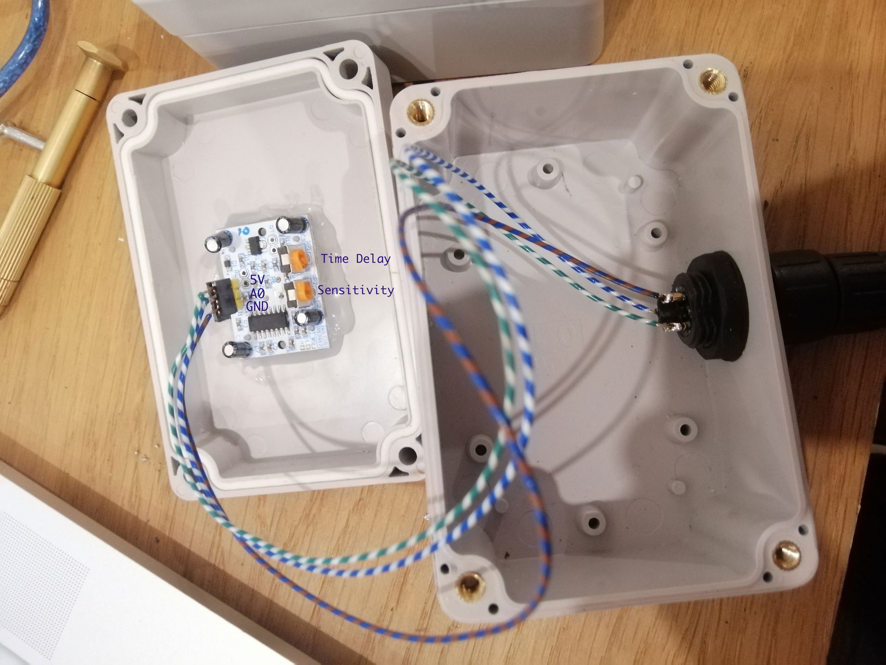

# IRSensor

### Dependency :

* Node.js : https://nodejs.org/en/

* p5-serial : [GitHub - p5-serial/p5.serialport: Serial Port API and Server for p5.js](https://github.com/p5-serial/p5.serialport)
  
  * `sudo npm install -g p5.serialserver`

### Run :

```
node startserver.js
```

### Hardware :

IRSensor : Outdoor

Arduino : Indoor





